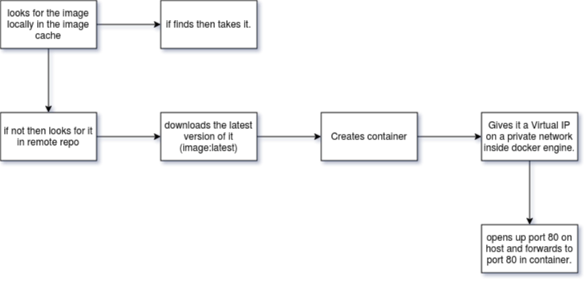

# Docker-Exploration

We are using here Docker CE (Community edition)

### Installation Steps

### Some Basic Docker Commands

| Command                                                                   | Description                                                                                                                      |
| ------------------------------------------------------------------------- | -------------------------------------------------------------------------------------------------------------------------------- |
| docker version                                                            | Get the version information of docker.                                                                                           |
| docker info                                                               | Get info.                                                                                                                        |
| docker images                                                             | Get all available images in local repo.                                                                                          |
| docker container ps / docker container ps -a                              | get running containers (-a all stopped & running)                                                                                |
| docker container run --publish 80:80 --detach --name test_container nginx | Run a container with nginx at port 80. All the traffic is routing from host IP port 80 to container IP port 80 serving on nginx. |
| docker container logs test_container                                      | get logs for mentioned container                                                                                                 |
| docker container top test_container                                       | Get process/daemons running in the container                                                                                     |
| docker container rm <container_id1> ...                                   | Remove stopped container. Containers to be removed should be stopped.                                                            |
| docker container rm -f <c_id>                                             | Remove forcefully.                                                                                                               |

### What happens behind docker run

### Points to Notice

- containers aren't mini VM's, they are just processes running on HOST Operating Systems.
- Limited to what resource they can access.
- Exit when process is stopped
