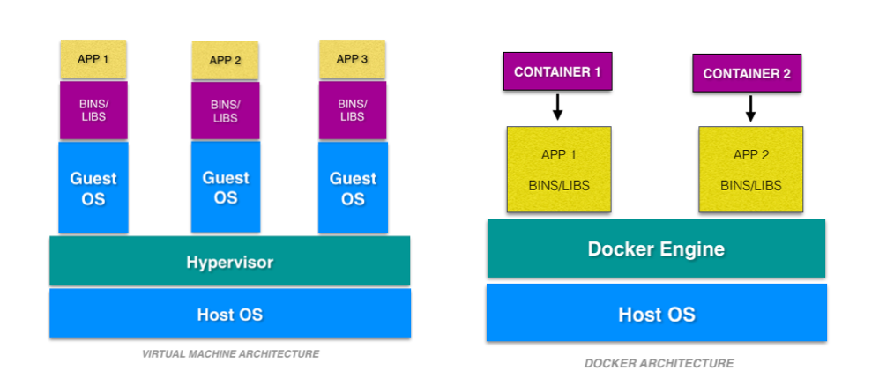

# Docker-Exploration

### Docker used for documentation : Docker CE (Community Edition)

### Some Basic Docker Commands

| Command                                                      | Description                                                                                       |
| ------------------------------------------------------------ | ------------------------------------------------------------------------------------------------- |
| docker version                                               | Get the version information of docker.                                                            |
| docker info                                                  | Get info.                                                                                         |
| docker images                                                | Get all available images in local repo.                                                           |
| docker container ps / docker container ps -a                 | get running containers (-a all stopped & running)                                                 |
| docker container run -p 80:80 -d --name test_container nginx | Run a container with nginx at port 80. bridge host IP 80 and container IP 80.                     |
| docker container run --rm -it image_name                     | run container and automatically remove upon close                                                 |
| docker container logs test_container                         | get logs for mentioned container                                                                  |
| docker container top test_container                          | Get process/daemons running in the container                                                      |
| docker container rm <container_id1> ...                      | Remove stopped container. Containers to be removed should be stopped.                             |
| docker container rm -f <c_id>                                | Remove forcefully.                                                                                |
| docker container inspect test_container                      | details of container config                                                                       |
| docker container stats                                       | show stats mem usage, cpu usage etc.                                                              |
| docker container run -it --name test_name image_name bash    | run container (-i --> interactive,-t --> pseudo tty/ssh) and opens bash(changed default commands) |
| docker container start -ai container_name                    | starts existing (-ai start with given starting command) container                                 |
| docker container stop container_name                         | stops existing container                                                                          |
| docker container exec -it container_name bash                | open bash in already running container                                                            |
| docker history image_name:tag                                | layer information of the image                                                                    |

### Port

        -p 8080:8080

        [host_os_port : docker_container_port]

### What happens behind docker run

### Points to Notice

- containers aren't mini VM's, they are just processes(binary files) running on HOST Operating Systems.
- Limited to what resource they can access.
- Exit when process is stopped

### Examples

#### nginx

- docker pull nginx:latest
- docker run -p 80:80 --name nginx -d nginx:latest
- curl localhost

#### mongo

- docker pull mongo:latest
- docker run -p 27017:27017 --name mongo -d mongo:latest
- mongo --host localhost --port 27017

#### mysql

- docker pull mysql:latest
- docker run -p 3306:3306 --name mysql -e MYSQL_RANDOM_ROOT_PASSWORD=yes -d mysql:latest
- get first random password from docker container logs mysql (GENERATED ROOT PASSWORD)
- mysql -uroot -p[password from previous step] -h127.0.0.1 -P3306

### Docker Networks

| Command                                                                             | Description                                                                                                            |
| ----------------------------------------------------------------------------------- | ---------------------------------------------------------------------------------------------------------------------- |
| docker container port container_name                                                | get port info                                                                                                          |
| docker container inspect --format "{{ .NetworkSettings.IPAddress }}" container_name | get IP                                                                                                                 |
| docker network ls                                                                   | show networks                                                                                                          |
| docker network inspect net_name                                                     | inspect a network                                                                                                      |
| docker network create --driver                                                      | create a network                                                                                                       |
| docker network connect net_id container_id                                          | attach                                                                                                                 |
| docker network disconnect net_id container_id                                       | detach                                                                                                                 |
| docker container run --name c_name --network net_name image_name                    | specifying network name in container while starting                                                                    |
| docker container run --name c_name --net net_name --net-alias alias_name image_name | specifying network name and alias in container while starting (same alias containers can be called with same DNS name) |

### DNS Naming (inter container communication)

- containers cant rely on IP's for inter-communication.
- bridge (default) doesnt have this option.
- one container can communicate with another in same network with container name(instead of IP).
- it is easier in docker compose.

#### try this

- docker pull nginx:latest
- docker network create custom_network
- docker network ls
- docker run -it -d -p 8081:80 --network custom_network --name nginx2 nginx:latest
- docker run -it -d -p 8080:80 --network custom_network --name nginx1 nginx:latest
- docker container ls
- docker container exec -it nginx1 curl http://nginx2

## IMAGE

- app binaries and dependencies
- metadata about image data or how to run the image
- An image is an ordered collection of root filesystem changes and corresponding execution parameters for use within a container runtime.
- Not a complete OS. No kerel ,kernel modules etc.

### Image Layers

| image  |
| ------ |
| env    |
| apt    |
| ubuntu |

| image1        | image2          |                                         |
| ------------- | --------------- | --------------------------------------- |
| port          | other operation | only diff is added in runtime container |
| copy          | copy            | common till here                        |
| apt           | apt             |                                         |
| Debian jessie | Debain jessie   |                                         |

example of layers:

### Image representation

        <user>/<repo>:<tag>

## DOCKERFILE

Dockerfile is a recipe for creating image.

| Command                               | Description                                                             |
| ------------------------------------- | ----------------------------------------------------------------------- |
| docker image build -f some-dockerfile | build image from a dockerfile                                           |
| docker image build -t custom_nginx .  | build docker image with tag custom_nginx from current working directory |

| Keyword    | Description                                                                                                                                                   |
| ---------- | ------------------------------------------------------------------------------------------------------------------------------------------------------------- |
| FROM       | All dockerfile must have to minimal distribution. want to go completely from scratch use "FROM scratch"                                                       |
| ENV        | Setting up environment variables. inject main key/values for image.                                                                                           |
| RUN        | Run shell commads                                                                                                                                             |
| EXPOSE     | Expose ports on docker virtual network still need to use -p / -P on host os                                                                                   |
| CMD        | Final command to be run every time container is launched/started                                                                                              |
| COPY       | Copy from local(host) os to docker(guest/virtual) os                                                                                                          |
| ENTRYPOINT | Entrypoint for a container at runtime                                                                                                                         |
| WORKDIR    | is prefered to using "RUN cd /some/path"                                                                                                                      |
| VOLUME     | Create a new volume location and assign it to the directory in the container will outlive the container when container is updated. (requires manual deletion) |
| ADD        |                                                                                                                                                               |

        It is adviced to keep least changing things in the
        docker images to keep on top(initial steps) and more
        variable things in later steps so that whenver any step changes or updates till that step cache will help to
        speed up the process of building the image.

## PRUNE

| Command             | Description                 |
| ------------------- | --------------------------- |
| docker image prune  | removbe all dangling images |
| docker system prune | remobe everything           |

## Container lifetime and persistent data

1. immutable (unchanging) and ephemeral (temporary/ disposable).
1. "immutable infrastructure" : only re-deploy containers, never change.
1. But if there is some data that has to be present (like database or unique data).
1. data can be preserved when container is getting updated with latest version.
   docker gives us feature to ensure "separation of concerns".
1. This is called as "Presistent data".
1. 2 solutions for this - Volumns and Bind Mounts.
1. <b> VOLUMES </b> : make special location outside of container UFS(union file system).
1. <b> BIND MOUNT </b> : link container path to host path.

## PERSISTENT DATA

- ### DATA VOLUMES

1. Create a new volume location and assign it to the directory in the container
1. will outlive the container when container is updated.
1. requires manual deletion

| Command                           | Description              |
| --------------------------------- | ------------------------ |
| docker volume ls                  | list of volumes          |
| docker volume inspect volume_name | information about volume |
| docker volume create volumne_name | create volume            |

        docker container run -d --name mysql -e MYSQL_ALLOW_EMPTY_PASSWORD=True -v mysql-db:/var/lib/mysql mysql:latest

- if name is provided then it will register by name otherwise by default a random name would be generated. (Named volumes)
- -v [name]:[path/to/volume]

- ### BIND MOUNTING

1.  Maps a host file or dir to container file or directory.
1.  basically two locations pointing to same file.
1.  Skips UFS, host files overwrite any in container.
1.  Cant use Dockerfile, has to be mentioned in docker container run command.
1.  -v [/host/fs/path]:[/container/fs/path]

1.  Try

        docker container run -it -d -p 3000:80 --name nginx -v /home/nishant/Desktop/Docker-Exploration/htmlexample:/usr/share/nginx/html nginx:latest

# Docker Compose

- Configure relationships between containers.
- Save docker container run settings in easy-to-read file
- One liner developer env setup.
- 1. YAML file - containers, networks, volumes, env.(default docker-compose.yml/yaml)
  1. CLI tool - docker-compose

## docker-compose CLI

- CLI tool is not a production grade tool but ideal for development and test.

| Command                        | Description                                                             |
| ------------------------------ | ----------------------------------------------------------------------- |
| docker-compose up              | setup volumes,networks and start all containers                         |
| docker-compose up -f file_name | setup volumes,networks and start all containers with a custom file_name |
| docker-compose down            | stop all containers and remove containers/vols/nets                     |
| docker-compose up -d           | setup volumes,networks and start all containers and detach              |
| docker-compose ps              | get services running                                                    |
| docker-compose run             |                                                                         |
| docker-compose stop            |                                                                         |

# Containers Everywhere

### Some major tasks

- automate container lifecycle
- easily scale up/down/out/in
- container recreation upon failing
- replace container without downtime (blue/green deploy)
- control/track container started
- create cross-node virtual network
- only trusted servers run containers
- store secrets, keys, passwords and access them in right containers

# Docker Swarm - container orchestration

- Swarm mode is a clustering solution built inside Docker
- docker swarm, docker node, docker service, docker stack, docker secret

## docker swarm init

- PKI and security automation
  1. Root signing certificate created for swarm
  1. certificate is issued for first manager node
  1. join tokens are created
- RAFT database created to store root CA, configs and secrets
  1. no additional key value storage system
  1. replicates logs amongs managers.

| Command                                            | Description                  |
| -------------------------------------------------- | ---------------------------- |
| docker swam init                                   | initialize                   |
| docker node ls                                     | list down nodes              |
| docker service create                              | creating a container service |
| docker service ps service_name                     | running process              |
| docker service update service_id --replicas number | update replicas              |

