Docker-Exploration
==================

Docker used for documentation : Docker CE (Community Edition)
-------------------------------------------------------------

.. figure:: ./sourceImages/logo.png
   :alt: logo

   logo

.. figure:: ./sourceImages/architecture.svg
   :alt: concept1

   concept1

-  go to https://get.docker.com/
-  take the script
-  install it- easy-peasy
-  curl -sSL https://get.docker.com/ \| sh

Some Basic Docker Commands
--------------------------

+--------------------------+-------------------------------------------+
| Command                  | Description                               |
+==========================+===========================================+
| docker version           | Get the version information of docker.    |
+--------------------------+-------------------------------------------+
| docker info              | Get info.                                 |
+--------------------------+-------------------------------------------+
| docker images            | Get all available images in local repo.   |
+--------------------------+-------------------------------------------+
| docker container ps /    | get running containers (-a all stopped &  |
| docker container ps -a   | running)                                  |
+--------------------------+-------------------------------------------+
| docker container run -p  | Run a container with nginx at port 80.    |
| 80:80 -d –name           | bridge host IP 80 and container IP 80.    |
| test_container nginx     |                                           |
+--------------------------+-------------------------------------------+
| docker container run –rm | run container and automatically remove    |
| -it image_name           | upon close                                |
+--------------------------+-------------------------------------------+
| docker container logs    | get logs for mentioned container          |
| test_container           |                                           |
+--------------------------+-------------------------------------------+
| docker container top     | Get process/daemons running in the        |
| test_container           | container                                 |
+--------------------------+-------------------------------------------+
| docker container rm …    | Remove stopped container. Containers to   |
|                          | be removed should be stopped.             |
+--------------------------+-------------------------------------------+
| docker container rm -f   | Remove forcefully.                        |
+--------------------------+-------------------------------------------+
| docker container inspect | details of container config               |
| test_container           |                                           |
+--------------------------+-------------------------------------------+
| docker container stats   | show stats mem usage, cpu usage etc.      |
+--------------------------+-------------------------------------------+
| docker container run -it | run container (-i –> interactive,-t –>    |
| –name test_name          | pseudo tty/ssh) and opens bash(changed    |
| image_name bash          | default commands)                         |
+--------------------------+-------------------------------------------+
| docker container start   | starts existing (-ai start with given     |
| -ai container_name       | starting command) container               |
+--------------------------+-------------------------------------------+
| docker container stop    | stops existing container                  |
| container_name           |                                           |
+--------------------------+-------------------------------------------+
| docker container exec    | open bash in already running container    |
| -it container_name bash  |                                           |
+--------------------------+-------------------------------------------+
| docker history           | layer information of the image            |
| image_name:tag           |                                           |
+--------------------------+-------------------------------------------+

Port
----

::

       -p 8080:8080

       [host_os_port : docker_container_port]

What happens behind docker run
------------------------------

.. figure:: ./sourceImages/imageProcessing1.png
   :alt: Image

   Image

Points to Notice
----------------

-  containers aren’t mini VM’s, they are just processes(binary files)
   running on HOST Operating Systems.
-  Limited to what resource they can access.
-  Exit when process is stopped

.. figure:: ./sourceImages/dockerVsVM.png
   :alt: concept2

   concept2

Examples
--------

nginx
~~~~~

-  docker pull nginx:latest
-  docker run -p 80:80 –name nginx -d nginx:latest
-  curl localhost

mongo
~~~~~

-  docker pull mongo:latest
-  docker run -p 27017:27017 –name mongo -d mongo:latest
-  mongo –host localhost –port 27017

mysql
~~~~~

-  docker pull mysql:latest

-  docker run -p 3306:3306 –name mysql -e MYSQL_RANDOM_ROOT_PASSWORD=yes
   -d mysql:latest

-  get first random password from docker container logs mysql (GENERATED
   ROOT PASSWORD)

-  mysql -uroot -p[password from previous step] -h127.0.0.1 -P3306

   or

-  docker run -p 3306:3306 –name mysql -e
   MYSQL_ROOT_PASSWORD=my-secret-pw -d mysql:latest

-  mysql -uroot -p my-secret-pw -h127.0.0.1 -P3306

Docker Networks
---------------

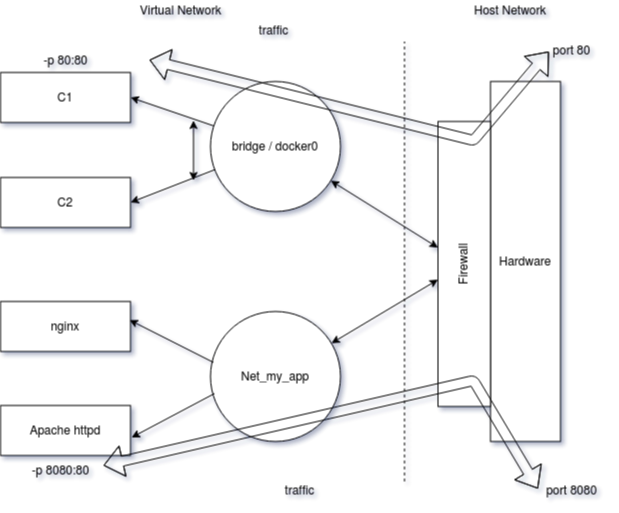

   concept3

+----------------------------+-----------------------------------------+
| Command                    | Description                             |
+============================+=========================================+
| docker container port      | get port info                           |
| container_name             |                                         |
+----------------------------+-----------------------------------------+
| docker container inspect   | get IP                                  |
| –format “{{                |                                         |
| .NetworkSettings.IPAddress |                                         |
| }}” container_name         |                                         |
+----------------------------+-----------------------------------------+
| docker network ls          | show networks                           |
+----------------------------+-----------------------------------------+
| docker network inspect     | inspect a network                       |
| net_name                   |                                         |
+----------------------------+-----------------------------------------+
| docker network create      | create a network                        |
| –driver                    |                                         |
+----------------------------+-----------------------------------------+
| docker network connect     | attach                                  |
| net_id container_id        |                                         |
+----------------------------+-----------------------------------------+
| docker network disconnect  | detach                                  |
| net_id container_id        |                                         |
+----------------------------+-----------------------------------------+
| docker container run –name | specifying network name in container    |
| c_name –network net_name   | while starting                          |
| image_name                 |                                         |
+----------------------------+-----------------------------------------+
| docker container run –name | specifying network name and alias in    |
| c_name –net net_name       | container while starting (same alias    |
| –net-alias alias_name      | containers can be called with same DNS  |
| image_name                 | name)                                   |
+----------------------------+-----------------------------------------+

DNS Naming (inter container communication)
------------------------------------------

-  containers cant rely on IP’s for inter-communication.
-  bridge (default) doesnt have this option.
-  one container can communicate with another in same network with
   container name(instead of IP).
-  it is easier in docker compose.

try this
~~~~~~~~

-  docker pull nginx:latest
-  docker network create custom_network
-  docker network ls
-  docker run -it -d -p 8081:80 –network custom_network –name nginx2
   nginx:latest
-  docker run -it -d -p 8080:80 –network custom_network –name nginx1
   nginx:latest
-  docker container ls
-  docker container exec -it nginx1 curl http://nginx2

IMAGE
-----

-  app binaries and dependencies
-  metadata about image data or how to run the image
-  An image is an ordered collection of root filesystem changes and
   corresponding execution parameters for use within a container
   runtime.
-  Not a complete OS. No kerel ,kernel modules etc.

Image Layers
~~~~~~~~~~~~

+--------+
| image  |
+========+
| env    |
+--------+
| apt    |
+--------+
| ubuntu |
+--------+

============= =============== =======================================
image1        image2          
============= =============== =======================================
port          other operation only diff is added in runtime container
copy          copy            common till here
apt           apt             
Debian jessie Debain jessie   
============= =============== =======================================

example of layers:

.. figure:: ./sourceImages/imagelayers.png
   :alt: imagelayers

   imagelayers

Image representation
~~~~~~~~~~~~~~~~~~~~

::

       <user>/<repo>:<tag>

DOCKERFILE
----------

Dockerfile is a recipe for creating image.

+-----------------------+----------------------------------------------+
| Command               | Description                                  |
+=======================+==============================================+
| docker image build -f | build image from a dockerfile                |
| some-dockerfile       |                                              |
+-----------------------+----------------------------------------------+
| docker image build -t | build docker image with tag custom_nginx     |
| custom_nginx .        | from current working directory               |
+-----------------------+----------------------------------------------+

+---+------------------------------------------------------------------+
| K | Description                                                      |
| e |                                                                  |
| y |                                                                  |
| w |                                                                  |
| o |                                                                  |
| r |                                                                  |
| d |                                                                  |
+===+==================================================================+
| F | All dockerfile must have to minimal distribution. want to go     |
| R | completely from scratch use “FROM scratch”                       |
| O |                                                                  |
| M |                                                                  |
+---+------------------------------------------------------------------+
| E | Setting up environment variables. inject main key/values for     |
| N | image.                                                           |
| V |                                                                  |
+---+------------------------------------------------------------------+
| R | Run shell commads                                                |
| U |                                                                  |
| N |                                                                  |
+---+------------------------------------------------------------------+
| E | Expose ports on docker virtual network still need to use -p / -P |
| X | on host os                                                       |
| P |                                                                  |
| O |                                                                  |
| S |                                                                  |
| E |                                                                  |
+---+------------------------------------------------------------------+
| C | Final command to be run every time container is launched/started |
| M |                                                                  |
| D |                                                                  |
+---+------------------------------------------------------------------+
| C | Copy from local(host) os to docker(guest/virtual) os             |
| O |                                                                  |
| P |                                                                  |
| Y |                                                                  |
+---+------------------------------------------------------------------+
| E | Entrypoint for a container at runtime                            |
| N |                                                                  |
| T |                                                                  |
| R |                                                                  |
| Y |                                                                  |
| P |                                                                  |
| O |                                                                  |
| I |                                                                  |
| N |                                                                  |
| T |                                                                  |
+---+------------------------------------------------------------------+
| W | is prefered to using “RUN cd /some/path”                         |
| O |                                                                  |
| R |                                                                  |
| K |                                                                  |
| D |                                                                  |
| I |                                                                  |
| R |                                                                  |
+---+------------------------------------------------------------------+
| V | Create a new volume location and assign it to the directory in   |
| O | the container will outlive the container when container is       |
| L | updated. (requires manual deletion)                              |
| U |                                                                  |
| M |                                                                  |
| E |                                                                  |
+---+------------------------------------------------------------------+
| A |                                                                  |
| D |                                                                  |
| D |                                                                  |
+---+------------------------------------------------------------------+

::

       It is adviced to keep least changing things in the
       docker images to keep on top(initial steps) and more
       variable things in later steps so that whenver any step changes or updates till that step cache will help to
       speed up the process of building the image.

PRUNE
-----

=================== ===========================
Command             Description
=================== ===========================
docker image prune  removbe all dangling images
docker system prune remobe everything
=================== ===========================

Container lifetime and persistent data
--------------------------------------

1. immutable (unchanging) and ephemeral (temporary/ disposable).
2. “immutable infrastructure” : only re-deploy containers, never change.
3. But if there is some data that has to be present (like database or
   unique data).
4. data can be preserved when container is getting updated with latest
   version. docker gives us feature to ensure “separation of concerns”.
5. This is called as “Presistent data”.
6. 2 solutions for this - Volumns and Bind Mounts.
7.  VOLUMES : make special location outside of container UFS(union file system).
8.  BIND MOUNT : link container path to host path.

PERSISTENT DATA
---------------

-  .. rubric:: DATA VOLUMES
      :name: data-volumes

1. Create a new volume location and assign it to the directory in the
   container
2. will outlive the container when container is updated.
3. requires manual deletion

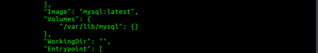

   volumeInfo

================================= ========================
Command                           Description
================================= ========================
docker volume ls                  list of volumes
docker volume inspect volume_name information about volume
docker volume create volumne_name create volume
================================= ========================

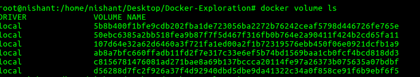

   volumes1

::

       docker container run -d --name mysql -e MYSQL_ALLOW_EMPTY_PASSWORD=True -v mysql-db:/var/lib/mysql mysql:latest

-  if name is provided then it will register by name otherwise by
   default a random name would be generated. (Named volumes)
-  -v [name]:[path/to/volume]

.. figure:: ./sourceImages/volumes2.png
   :alt: volumes2

   volumes2

-  .. rubric:: BIND MOUNTING
      :name: bind-mounting

1. Maps a host file or dir to container file or directory.

2. basically two locations pointing to same file.

3. Skips UFS, host files overwrite any in container.

4. Cant use Dockerfile, has to be mentioned in docker container run
   command.

5. -v [/host/fs/path]:[/container/fs/path]

6. Try

   ::

      docker container run -it -d -p 3000:80 --name nginx -v /home/nishant/Desktop/Docker-Exploration/htmlexample:/usr/share/nginx/html nginx:latest

Docker Compose
==============

-  Configure relationships between containers.

-  Save docker container run settings in easy-to-read file

-  One liner developer env setup.

-  

   1. YAML file - containers, networks, volumes, env.(default
      docker-compose.yml/yaml)
   2. CLI tool - docker-compose

docker-compose CLI
------------------

-  CLI tool is not a production grade tool but ideal for development and
   test.

+--------------------+-------------------------------------------------+
| Command            | Description                                     |
+====================+=================================================+
| docker-compose up  | setup volumes,networks and start all containers |
+--------------------+-------------------------------------------------+
| docker-compose up  | setup volumes,networks and start all containers |
| -f file_name       | with a custom file_name                         |
+--------------------+-------------------------------------------------+
| docker-compose     | stop all containers and remove                  |
| down               | containers/vols/nets                            |
+--------------------+-------------------------------------------------+
| docker-compose up  | setup volumes,networks and start all containers |
| -d                 | and detach                                      |
+--------------------+-------------------------------------------------+
| docker-compose ps  | get services running                            |
+--------------------+-------------------------------------------------+
| docker-compose run |                                                 |
+--------------------+-------------------------------------------------+
| docker-compose     |                                                 |
| stop               |                                                 |
+--------------------+-------------------------------------------------+

Containers Everywhere
=====================

Some major tasks
----------------

-  automate container lifecycle
-  easily scale up/down/out/in
-  container recreation upon failing
-  replace container without downtime (blue/green deploy)
-  control/track container started
-  create cross-node virtual network
-  only trusted servers run containers
-  store secrets, keys, passwords and access them in right containers

Docker Swarm - container orchestration
======================================

.. figure:: ./sourceImages/swarm5.png
   :alt: swarm5

   swarm5

-  Swarm mode is a clustering solution built inside Docker
-  docker swarm, docker node, docker service, docker stack, docker
   secret

|swarm1| |swarm2| |swarm3| |swarm4|

docker swarm init
-----------------

-  PKI and security automation

   1. Root signing certificate created for swarm
   2. certificate is issued for first manager node
   3. join tokens are created

-  RAFT database created to store root CA, configs and secrets

   1. no additional key value storage system
   2. replicates logs amongs managers.

+----------------------------------+-----------------------------------+
| Command                          | Description                       |
+==================================+===================================+
| docker swarm init                | initialize                        |
+----------------------------------+-----------------------------------+
| docker node ls                   | list down nodes                   |
+----------------------------------+-----------------------------------+
| docker service create            | creating a container service      |
+----------------------------------+-----------------------------------+
| docker service ls                | list down services                |
+----------------------------------+-----------------------------------+
| docker service ps service_name   | process information               |
+----------------------------------+-----------------------------------+
| docker service update service_id | update replicas                   |
| –replicas number                 |                                   |
+----------------------------------+-----------------------------------+
| docker service rm service_name   | remove service and delete all     |
|                                  | containers one by one             |
+----------------------------------+-----------------------------------+

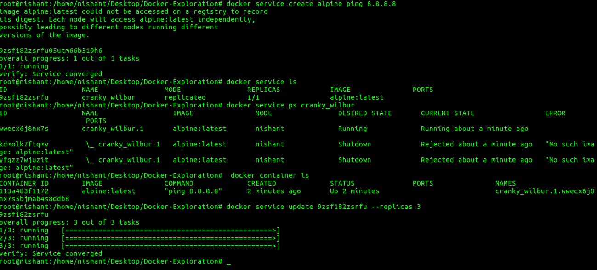

   docker-service1

-  if a service is running and we stop one of its replicas by running
   “docker container rm -f some_id/name” then it will show in the
   results of “docker service ls” (one less replica) but within seconds
   it will again start it and it will show in the result if “docker
   service ps service_name” that one service was stopped.

.. figure:: ./sourceImages/dockerService2.png
   :alt: docker-service2

   docker-service2

PLAYGROUND
----------

-  https://labs.play-with-docker.com
-  use above link to create instances and play with them

Steps
-----

-  get 3 instances

-  in one instance run

   ::

        docker swarm  init --advertise-addr <public_ip>

-  this will give a url like

   ::

        docker swarm join --token <some token>

-  run this command in other two instances to join them in this cluster

-  now docker swarm commands cant be run in these worker nodes

-  Run in the leader instance

   ::

        docker node ls

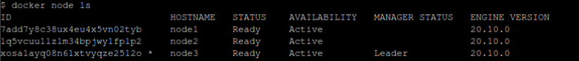

   dokcer-swarm1

-  change the role of a node

.. figure:: ./sourceImages/dockerSwarm2.png
   :alt: docker-swarm2

   docker-swarm2

-  get the manager token to join anytime and add instance with
   predefined manager role

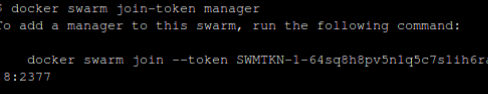

   docker-swarm3

-  get the worker token to join anytime

.. figure:: ./sourceImages/dockerSwarm4.png
   :alt: docker-swarm4

   docker-swarm4

-  now create a service with 3 replicas

|docker-swarm5| |docker-swarm6|

Overlay Multi Host Networking
=============================

-  choose –driver overlay when creating network
-  for container to container traffic inside a Single Swarm
-  Optional IPSec (AES) encryption on network creation
-  Each service can connect to multiple networks

+-----------------------------------+----------------------------------+
| Command                           | Description                      |
+===================================+==================================+
| docker network create –driver     | create a overlay network         |
| overlay network_name              |                                  |
+-----------------------------------+----------------------------------+
| |docker-network1|                 | creating a network               |
+-----------------------------------+----------------------------------+
| |docker-network3|                 | creating two services on one     |
|                                   | network                          |
+-----------------------------------+----------------------------------+
| |docker-network2|                 | accessing them by their service  |
|                                   | name (look at host)              |
+-----------------------------------+----------------------------------+

Routing Mesh (Internal Load Balancer)
-------------------------------------

-  Routes/distributes ingress (incoming) packets for a service to a
   proper task
-  spans all the nodes
-  Uses IPVS from linux kernel (kernel primitives)
-  Load balances swarm services across their tasks
-  ways to work

   -  container to container overlay network (talking to virtual IP/VIP)
   -  external traffic incoming to publishing ports (all nodes listen)

-  stateless load balancing

docker stack
============

Production Grade Compose
------------------------

-  New layer of abstraction to swarms called stacks

-  accepts compose files

-  ``docker stack deploy``

   ::

                 services  task and container
                     ^          ^
                || service1 -| node 1  |  
                ||          -| node 2  |  || Volumes ||
                ||-------------------- |
        Stack ->|| service2 -| node 1  |
                ||          -| node 2  |
                ||-------------------- | || Overlay Networks ||
                || service3 -| node 1  |
                ||          -| node 2  |

+-----------------------------+----------------------------------------+
| Command                     | Description                            |
+=============================+========================================+
| docker stack deploy -c      | queue deploy services from a compose   |
| compose_file app_name       | file                                   |
+-----------------------------+----------------------------------------+
| docker stack ls             | list all the apps in the stack         |
+-----------------------------+----------------------------------------+
| docker stack ps app_name    | list down services in the app          |
+-----------------------------+----------------------------------------+
| docker stack services       | gives important info about services    |
| app_name                    | like replicas,mode etc.                |
+-----------------------------+----------------------------------------+

docker secrets
==============

-  key value store in docker run time
-  attach it to services only those can use it

+--------------------------------+-------------------------------------+
| Command                        | Description                         |
+================================+=====================================+
| docker secret create           | put value in secret by a file       |
| secret_name secret_file.txt    |                                     |
+--------------------------------+-------------------------------------+
| echo “some_value” \| docker    | put value in secret by echoing      |
| secret create secret_name -    |                                     |
+--------------------------------+-------------------------------------+
| docker secret ls               | list down secrets                   |
+--------------------------------+-------------------------------------+
| ——–                            | ——–                                 |
+--------------------------------+-------------------------------------+
| with service                   |                                     |
+--------------------------------+-------------------------------------+
| docker service create –name    | create a service with a secret      |
| service_name –secret           | mentioned that can be used by       |
| secret_name                    | container                           |
+--------------------------------+-------------------------------------+
| docker service update          | remove secret                       |
| –secret-rm secret_name         |                                     |
+--------------------------------+-------------------------------------+

Swarm App LifeCycle
===================

::

       TODO

Kubernetes
==========

-  container orchestration
-  runs on top of docker (usually)
-  provides api/cli to manage containers across servers

sandbox
-------

-  https://labs.play-with-k8s.com/
-  katacoda

Other flavours
--------------

-  minikube
-  MicroK8s

Cloud providers
---------------

-  Azure Kubernetes Services (AKS)
-  AWS (EKS)
-  Google Cloud

Terminologies
-------------

-  kubectl - cube control (cli)

-  node - single server inside the cluster

-  kubelet - Kubernetes agent running on nodes

   ::

        In swarm in build docker swarm agent is available for workers to talk back to the master nodes kubernetes needs one explicitly

-  control plane - set of containers that manages the clusters

   -  includes api server , scheduler, control manager, etcd and more

   -  sometimes called the master

      ::

                 MASTER
         |=======================|
         | etcd                  |
         | api                   |
         | scheduler             |
         | controller manager    |
         | core dns              |
         | .                     |
         | .                     |
         | based on need         |
         |                       |
         | Docker                |
         |=======================|

                 NODE
         |=======================|
         | kubelet               |
         | kube-proxy            |
         | .                     |
         | .                     |
         | based on need         |
         |                       |
         |                       |
         |                       |
         | Docker                |
         |=======================|

-  pod - one or more containers running together on one Node

   -  basic unit of deployment, containers are always in pods

-  controller - for creating /updating pods and other objects

   -  Deployment
   -  ReplicaSet
   -  StatefulSet
   -  DaemonSet
   -  Job
   -  CronJob

-  service - network endpoint to connect to a pod

-  namespace - filter group

-  secrets, ConfigMaps …

in play with k8s
----------------

-  I created 3 instances
-  I am going to make node1 as master/ manager node
-  Rest of the nodes will be worker nodes
-  Main goal is to create deplotyments

+--------------------------------------------+-------------------------+
| Snaps                                      | Description             |
+============================================+=========================+
| kubectl get nodes                          | get nodes connected to  |
|                                            | the cluster             |
+--------------------------------------------+-------------------------+
| |kube1|                                    | starting master node    |
|                                            | (command already        |
|                                            | provided with k8s       |
|                                            | playground)             |
+--------------------------------------------+-------------------------+
| |kube2|                                    | getting version (one    |
|                                            | client and one server ) |
+--------------------------------------------+-------------------------+
| kubectl run my_nginx –image nginx |kube3|  | run a pod               |
+--------------------------------------------+-------------------------+
| kubectl get pods |kube4|                   | get pods                |
+--------------------------------------------+-------------------------+
| kubectl create deployment my-nginx –image  | create deployment       |
| nginx |kube6| |kube7|                      |                         |
+--------------------------------------------+-------------------------+
| |kube5|                                    | get all contents        |
+--------------------------------------------+-------------------------+
| kubectl delete deployment my-nginx         | delete the deployment   |
+--------------------------------------------+-------------------------+

::

       Pods --> ReplicaSet --> Deployment

.. figure:: ./sourceImages/kube6.png
   :alt: kube6

   kube6

Scaling ReplicaSets
-------------------

|kube9| |kube10|

======== =============================================
Snaps    Description
======== =============================================
|kube11| logs
|kube12| logs follow changes and tail last 1 line logs
|kube13| describe pod/deployments etc
|kube14| watch
======== =============================================

Service Types
-------------

-  kubectl expose creates a service for exisiting pods
-  Service is a stable address for pod
-  it we want to connect to pod, we need a service
-  CoreDNS allows us to resolve ``services`` by name
-  Types of services :

   1. ClusterIP
   2. NodePort
   3. LoadBalancer
   4. ExternalName

ClusterIP (default)
-------------------

-  Single, Internal Virtual IP allocation
-  Reachable within the cluster
-  pods can reach service on port number

NodePort
--------

-  High port on each node
-  Outside the cluster
-  port is open for every node’s IP
-  Anyone can reach node can connect

LoadBalancer
------------

-  Controls a Load Balancer external to the cluster
-  Only available when infrastructure providers gives it (AWS ELB etc)
-  Create NodePort+ClusterIP, connect LB to NodePort to send

ExternalName
------------

-  Add CNAME DNS record to CoreDNS only
-  Not used for pods , but for giving pods a DNS name that can be used
   outside Kubernetes cluster.

+---------------+------------------------------------------------------+
| Snaps         | Description                                          |
+===============+======================================================+
| |kube15|      | create service expose port with cluster IP           |
+---------------+------------------------------------------------------+
| |kube16|      | create service NodePort. different than docker as    |
|               | left port if internal port and right one is node     |
|               | port for outside cluster                             |
+---------------+------------------------------------------------------+
| |kube17|      | create service with LoadBalancer                     |
+---------------+------------------------------------------------------+
| |kube18|      | namespaces                                           |
+---------------+------------------------------------------------------+

Kubernetes Management Techniques
================================

Generators (Automation behind commands)
---------------------------------------

-  Helper templates

-  Every resource in kubernetes has a ‘spec’ or specification

   ::

        > kubectl create deployment smaple --iamge nginx --dry-run -o yaml

-  output those templates ``--dry-run -o yaml``

-  these yaml defaults can be a starting points to create new ones

======== =================================
Snaps    Description
======== =================================
|kube19| Get Generator info for deployemnt
|kube20| Get Generator info for job
|kube21| Get Generator info for expose
======== =================================

+-----------------------------+---------------------------------------+
| Imperative                  | Decalarative                          |
+=============================+=======================================+
| how program operates        | what a program should accomplish      |
+-----------------------------+---------------------------------------+
| ex.- making your own coffee | ex.- give instructions to a barista   |
+-----------------------------+---------------------------------------+
| not easy to automate        | automation is good                    |
+-----------------------------+---------------------------------------+
| know every step             | dont know current state, only final   |
|                             | result is known                       |
+-----------------------------+---------------------------------------+
| -                           | requires to know all yaml keys        |
+-----------------------------+---------------------------------------+

Management approaches
---------------------

-  Imperative commands

   -  create, expose, edit, scale etc

-  Imperative objects

   -  create -f file.yml , replace -f file.yml

-  Declarative objects

   -  apply -f file.yml

Kubernetes Configuration YAML
-----------------------------

-  Each file contains one or more configuration files
-  Each manifest describes an API object (deployment, job, secret)
-  Each mainfest needs these four parts-

   -  apiVersion:
   -  kind:
   -  metadata:
   -  spec:

-  ``kubectl apply -f <directory>/``
-  selectors is used for patternmatching for different services

+----------------------------+----------+----------------------------+
| info                       | Snaps    | Description                |
+============================+==========+============================+
| cluster                    | |kube22| | cluster info               |
+----------------------------+----------+----------------------------+
| ``kind``                   | |kube23| | api resources (kind will   |
|                            |          | give info for yaml file)   |
+----------------------------+----------+----------------------------+
| ``apiVersion``             | |kube24| | api versions               |
+----------------------------+----------+----------------------------+
| ``metadata``               | -        | only ``name`` of the       |
|                            |          | service is required        |
+----------------------------+----------+----------------------------+
| ``spec``                   | -        | all the action             |
+----------------------------+----------+----------------------------+
| explain services           | |kube25| | explain services get       |
| recursively                |          | keywords                   |
+----------------------------+----------+----------------------------+
| explain services           | |kube26| | explain services get       |
| description                |          | keywords                   |
+----------------------------+----------+----------------------------+
| explain deployments        | |kube27| | explain services get       |
| description                |          | keywords                   |
+----------------------------+----------+----------------------------+

-  https://kubernetes.io/docs/reference/#api-reference

======== ===========================================================
Snaps    Description
======== ===========================================================
|kube28| find the difference between running service and updated yml
======== ===========================================================

Labels and Annotations
----------------------

-  labels under metadata
-  for grouping, filtering etc.
-  examples - tier: frontend, app: api, env: prod etc.
-  

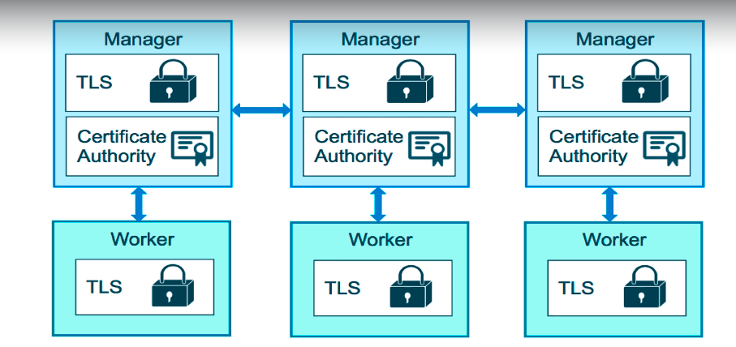
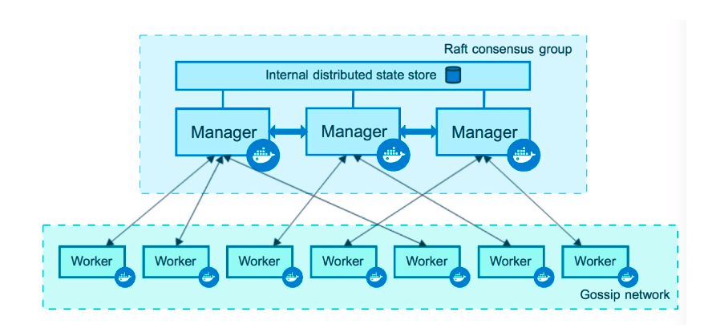
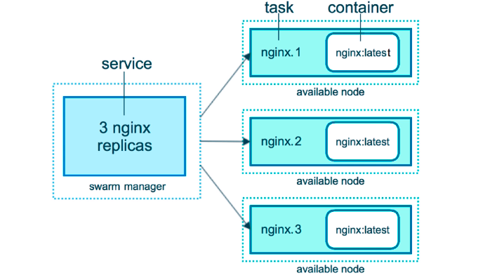
.. |swarm4| image:: ./sourceImages/swarm4.png
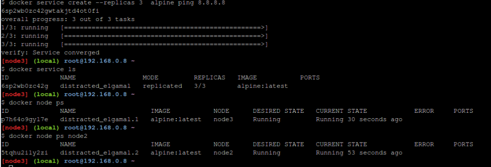
.. |docker-swarm6| image:: ./sourceImages/dockerSwarm6.png
.. |docker-network1| image:: ./sourceImages/dockerNetwork1.png
.. |docker-network3| image:: ./sourceImages/dockerNetwork3.png
.. |docker-network2| image:: ./sourceImages/dockerNetwork2.png
.. |kube1| image:: ./sourceImages/kube1.png
.. |kube2| image:: ./sourceImages/kube2.png
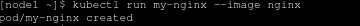
.. |kube4| image:: ./sourceImages/kube4.png
.. |kube6| image:: ./sourceImages/kube7.png
.. |kube7| image:: ./sourceImages/kube8.png
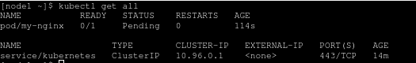
.. |kube9| image:: ./sourceImages/kube9.png
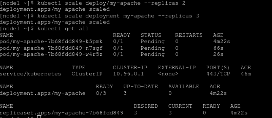
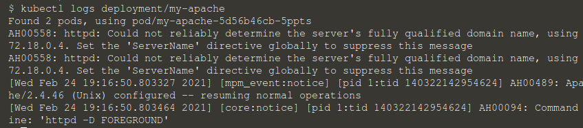
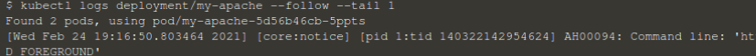
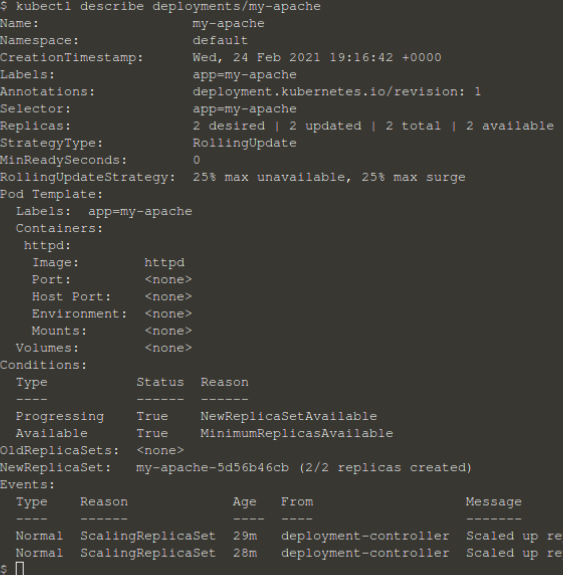
.. |kube14| image:: ./sourceImages/kube14.png
.. |kube15| image:: ./sourceImages/kube15.png
.. |kube16| image:: ./sourceImages/kube16.png
.. |kube17| image:: ./sourceImages/kube17.png
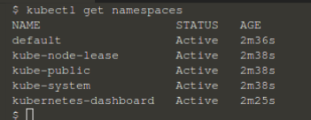
.. |kube19| image:: ./sourceImages/kube19.png
.. |kube20| image:: ./sourceImages/kube20.png
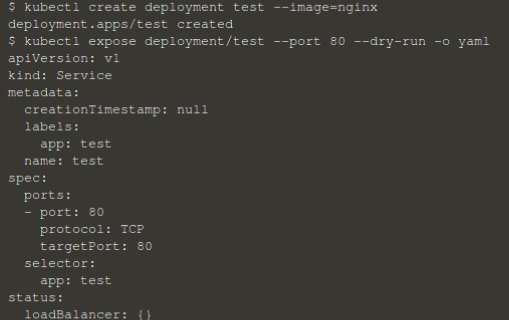
.. |kube22| image:: ./sourceImages/kube22.png
.. |kube23| image:: ./sourceImages/kube23.png
.. |kube24| image:: ./sourceImages/kube24.png
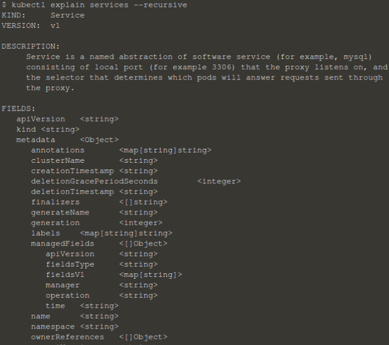
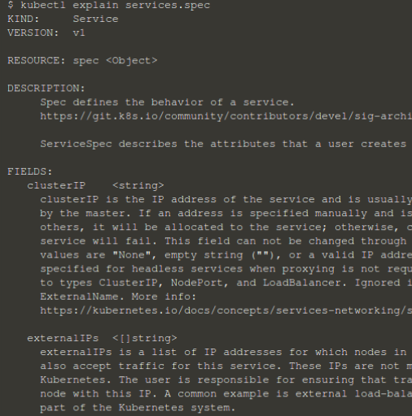
.. |kube27| image:: ./sourceImages/kube27.png
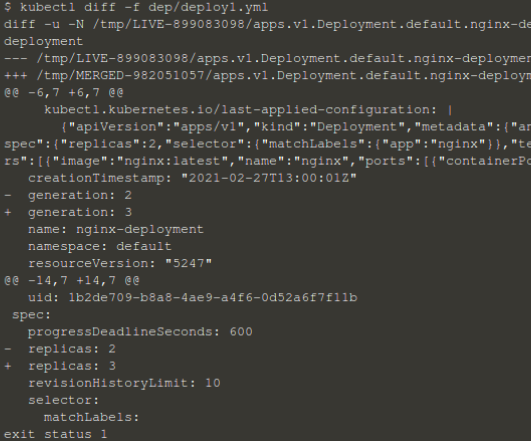
